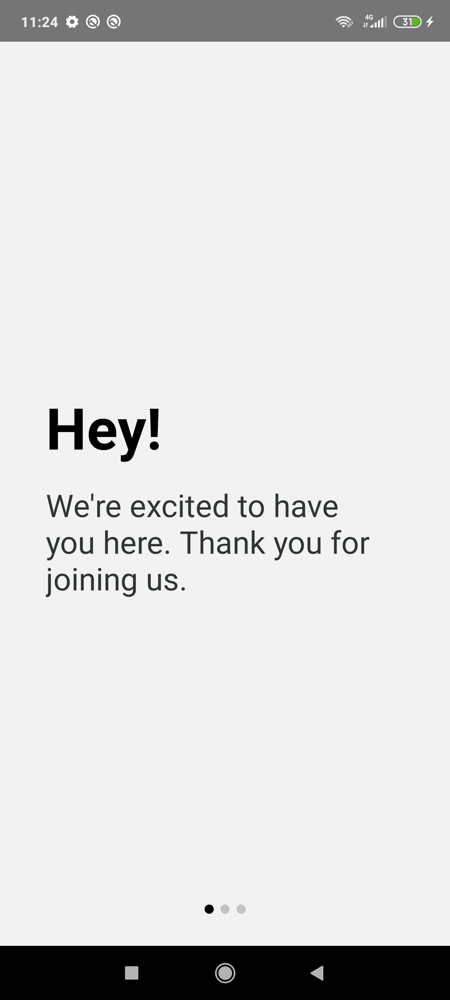
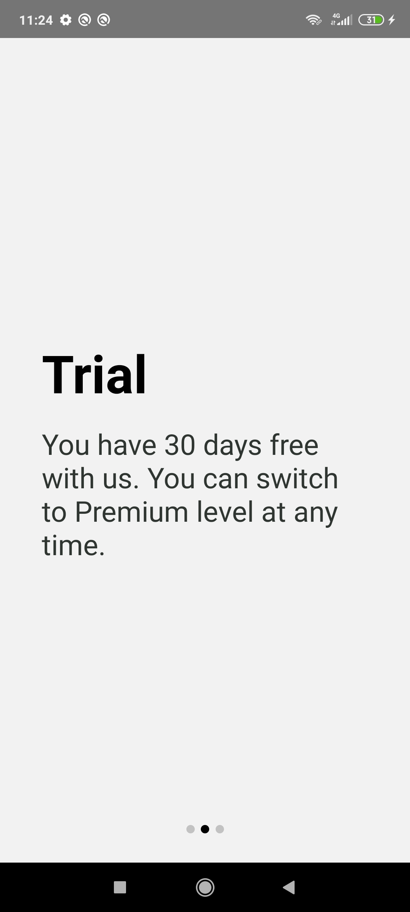
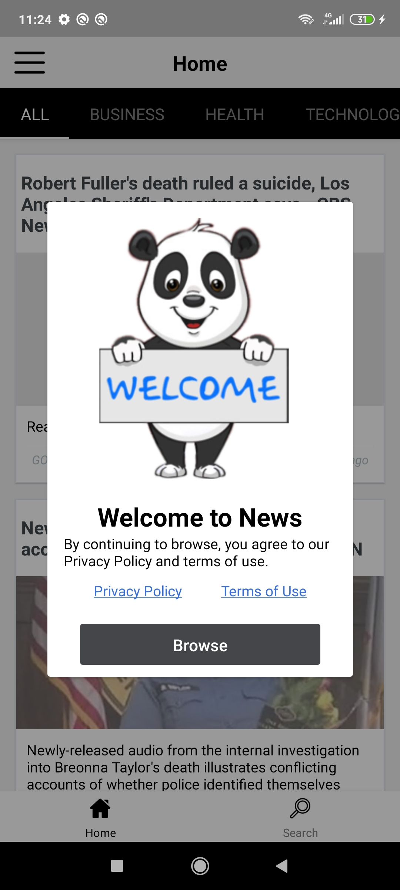
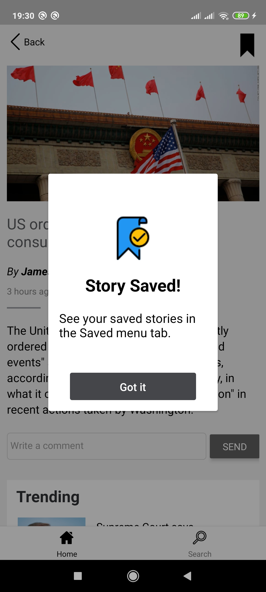
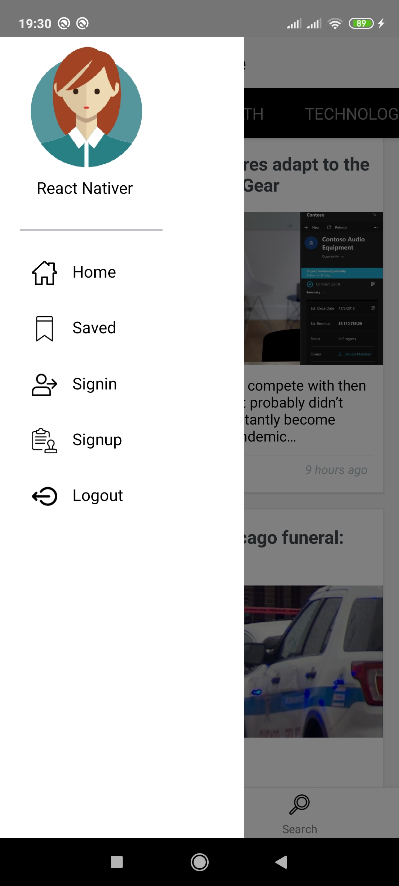
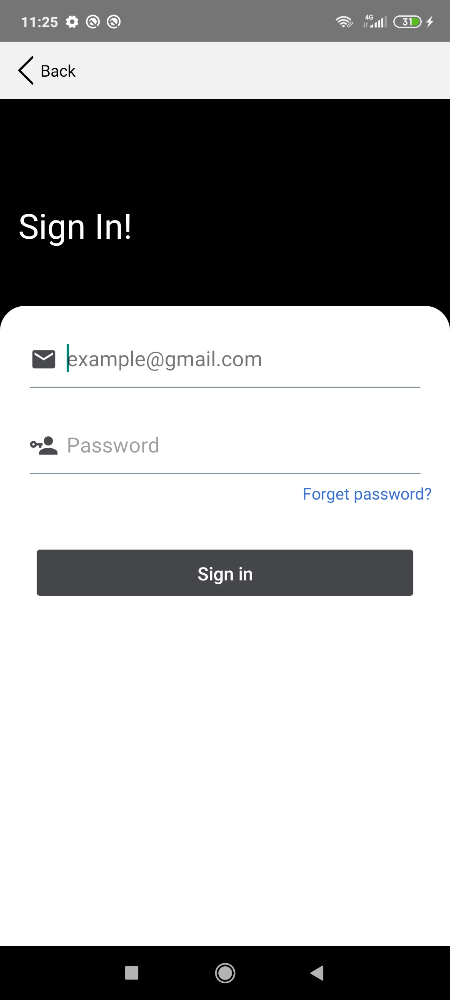
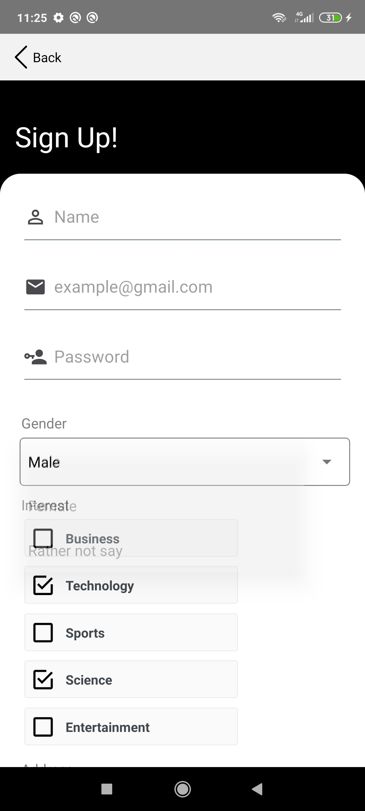
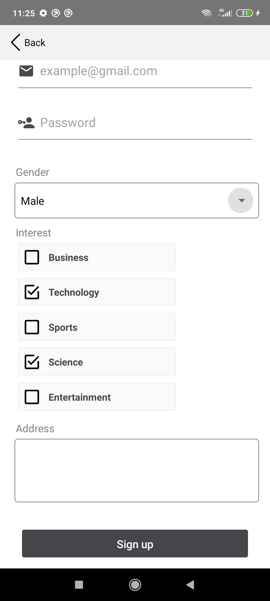
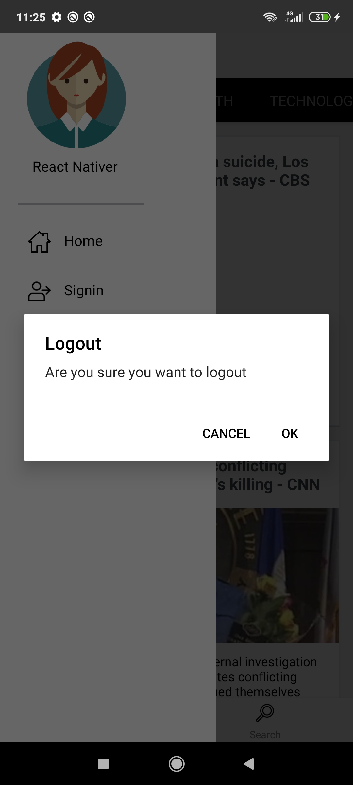

# NewsApp (Android-React Native)

NewsApp built using react native.

> Get news headlines around the world with short description filtered by your interests category and search keyword. You can also save/unsave the stories.

## Overview
This NewsApp is built using React Native in which I have used different components to implement app interface and functionality. 
* Navigation between screens (Tabs + Drawer + Stack)
* Scrolling list views
* Page swiper
* Overlay
* Props, State & style
* Custom components
 
## Functionality 
* Displays news headlines and news details around the world covering all categories
* Search functionality
* Save functionality
* Signin/Signup UI
* Logout

## Built With

- react native
- redux
- react-navigation
- react-native-elements
- react-native-vector-icons
- other stuff...

---

This project uses the [**News API**](https://newsapi.org/)

